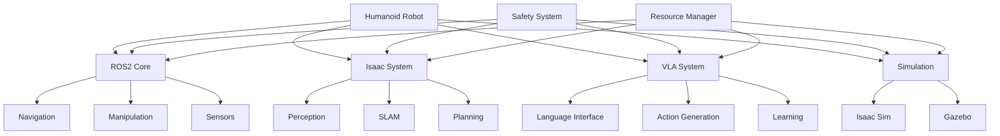

# Chapter 1: System Integration

## Learning Outcomes

After completing this chapter, you will be able to:
- Integrate ROS2, simulation environments, Isaac systems, and VLA models
- Design complex multi-robot systems with coordinated behavior
- Implement robust communication and coordination mechanisms
- Create scalable architectures for humanoid robotics applications

## 1. Introduction to System Integration

System integration in humanoid robotics involves combining multiple technologies and frameworks into cohesive, functional systems. This includes:

### Integration Challenges
- **Multi-framework coordination**: ROS2, Isaac ROS, custom controllers
- **Real-time constraints**: Synchronization across different systems
- **Communication protocols**: Efficient data exchange between components
- **Safety systems**: Coordinated safety across all subsystems
- **Resource management**: CPU, GPU, and memory allocation

### Integration Strategies
- **Modular architecture**: Well-defined interfaces between components
- **Service-oriented design**: Independent, reusable services
- **Event-driven systems**: Asynchronous communication patterns
- **Containerization**: Isolated and portable components

## 2. Multi-Framework Architecture

### ROS2 as Integration Layer
ROS2 provides the communication backbone for integrated systems:

```python
import rclpy
from rclpy.node import Node
from std_msgs.msg import String
from sensor_msgs.msg import Image, JointState
from geometry_msgs.msg import Twist

class IntegrationNode(Node):
    def __init__(self):
        super().__init__('system_integration')

        # Publishers for different subsystems
        self.ros_control_pub = self.create_publisher(JointState, '/joint_commands', 10)
        self.navigation_pub = self.create_publisher(Twist, '/cmd_vel', 10)

        # Subscribers for system state
        self.perception_sub = self.create_subscription(Image, '/camera/image_raw', self.perception_callback, 10)
        self.safety_sub = self.create_subscription(String, '/safety_status', self.safety_callback, 10)

        # Timer for system coordination
        self.timer = self.create_timer(0.1, self.system_tick)

        self.get_logger().info('System Integration Node Started')

    def perception_callback(self, msg):
        # Process perception data
        pass

    def safety_callback(self, msg):
        # Handle safety events
        pass

    def system_tick(self):
        # Coordinate system activities
        pass
```

### Isaac Integration
Connecting Isaac components with ROS2 systems:

```python
# Isaac Sim to ROS2 bridge
import omni
import rclpy
from rclpy.node import Node
from sensor_msgs.msg import JointState

class IsaacROSBridge(Node):
    def __init__(self):
        super().__init__('isaac_ros_bridge')

        # ROS2 publisher for Isaac data
        self.joint_pub = self.create_publisher(JointState, '/isaac_joint_states', 10)

        # Connect to Isaac Sim
        self.setup_isaac_connection()

    def setup_isaac_connection(self):
        # Set up USD stage and robot articulation
        self.stage = omni.usd.get_context().get_stage()
        self.robot = self.get_robot_from_stage()

    def sync_robot_state(self):
        # Synchronize Isaac Sim robot state with ROS2
        joint_state = JointState()
        # Populate joint positions, velocities, efforts from Isaac
        self.joint_pub.publish(joint_state)
```

## 3. Communication Architecture

### Message Queues and Buffers
Efficient data management across integrated systems:

```python
import queue
import threading
from collections import deque

class MessageManager:
    def __init__(self):
        self.perception_queue = queue.Queue(maxsize=10)
        self.control_queue = queue.Queue(maxsize=10)
        self.state_buffer = deque(maxlen=100)  # Rolling window of state

    def add_perception_data(self, data):
        try:
            self.perception_queue.put_nowait(data)
        except queue.Full:
            # Handle queue overflow
            pass

    def get_control_command(self):
        try:
            return self.control_queue.get_nowait()
        except queue.Empty:
            return None
```

### Real-time Synchronization
Ensuring timely coordination between subsystems:

```python
import time
import threading

class RealTimeCoordinator:
    def __init__(self, control_frequency=100):  # 100 Hz
        self.control_period = 1.0 / control_frequency
        self.last_update = time.time()

    def wait_for_next_cycle(self):
        current_time = time.time()
        elapsed = current_time - self.last_update
        sleep_time = self.control_period - elapsed

        if sleep_time > 0:
            time.sleep(sleep_time)

        self.last_update = time.time()
```

## 4. Safety and Fault Tolerance

### Multi-Level Safety Architecture
Safety systems that span across all integrated components:

```python
class SafetyManager:
    def __init__(self):
        self.emergency_stop = False
        self.safety_zones = []
        self.fault_conditions = {}

    def check_safety(self, robot_state, sensor_data):
        # Check multiple safety conditions
        if self.check_collision_zones(robot_state):
            return self.trigger_safety_stop("Collision detected")

        if self.check_joint_limits(robot_state):
            return self.trigger_safety_stop("Joint limit exceeded")

        if self.check_velocity_limits(robot_state):
            return self.trigger_safety_stop("Velocity limit exceeded")

        return True  # All safe

    def trigger_safety_stop(self, reason):
        self.emergency_stop = True
        # Publish emergency stop to all subsystems
        self.publish_emergency_stop()
        return False
```

### Fault Detection and Recovery
Automatic detection and handling of system failures:

```python
class FaultTolerance:
    def __init__(self):
        self.component_status = {}
        self.recovery_strategies = {}

    def monitor_component(self, component_name, health_check_func):
        status = health_check_func()
        self.component_status[component_name] = status

        if not status:
            self.handle_component_failure(component_name)

    def handle_component_failure(self, component_name):
        # Implement recovery strategy
        recovery_strategy = self.recovery_strategies.get(component_name)
        if recovery_strategy:
            recovery_strategy()
```

## 5. Performance Optimization

### Resource Management
Efficient allocation of computational resources:

```python
import psutil
import GPUtil

class ResourceManager:
    def __init__(self):
        self.cpu_threshold = 0.8  # 80% CPU usage
        self.gpu_threshold = 0.85  # 85% GPU usage
        self.memory_threshold = 0.9  # 90% memory usage

    def check_resources(self):
        cpu_percent = psutil.cpu_percent()
        memory_percent = psutil.virtual_memory().percent
        gpu_percent = 0

        gpus = GPUtil.getGPUs()
        if gpus:
            gpu_percent = gpus[0].load

        return {
            'cpu_ok': cpu_percent < self.cpu_threshold,
            'gpu_ok': gpu_percent < self.gpu_threshold,
            'memory_ok': memory_percent < self.memory_threshold
        }
```

## Safety Considerations

⚠️ **IMPORTANT SAFETY NOTICE**: When implementing integrated systems:
- Design redundant safety systems that operate independently
- Implement emergency stops that can override all subsystems
- Plan for graceful degradation when components fail
- Include comprehensive monitoring and alerting systems
- Follow functional safety standards (ISO 13482 for service robots, etc.)

## Exercises

1. Design an integration architecture that connects ROS2, Isaac Sim, and a VLA system for a humanoid robot.
2. Implement a safety manager that coordinates safety across multiple subsystems.
3. Create a resource management system that optimizes performance across integrated components.

## Diagram

