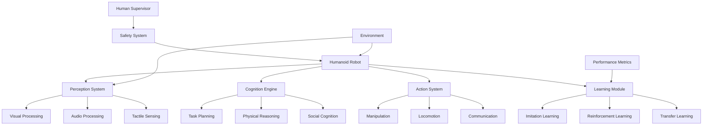

# Chapter 2: Advanced Applications

## Learning Outcomes

After completing this chapter, you will be able to:
- Design and implement complex humanoid robotics applications
- Apply Physical AI principles to real-world challenges
- Evaluate and optimize humanoid robot performance in complex tasks
- Plan for deployment and scaling of humanoid robotics systems

## 1. Humanoid Robotics Applications

### Physical AI Principles
Humanoid robots embody Physical AI by combining:
- **Perception**: Multi-modal sensing and understanding
- **Cognition**: Reasoning and decision making
- **Action**: Physical interaction with the environment
- **Learning**: Adaptation and improvement over time

### Key Application Domains
- **Healthcare and Assistance**: Elderly care, rehabilitation, surgery assistance
- **Manufacturing and Industry**: Collaborative assembly, quality inspection
- **Service Industries**: Hospitality, retail, customer service
- **Research and Exploration**: Scientific research, space/underwater exploration

## 2. Complex Task Implementation

### Multi-Modal Task Execution
Implementing tasks that require coordination of multiple capabilities:

```python
import rclpy
from rclpy.node import Node
from std_msgs.msg import String
from geometry_msgs.msg import Pose
from sensor_msgs.msg import Image
import numpy as np

class HumanoidTaskExecutor(Node):
    def __init__(self):
        super().__init__('humanoid_task_executor')

        # Task state management
        self.current_task = None
        self.task_sequence = []
        self.task_context = {}

        # Publishers and subscribers
        self.manipulation_pub = self.create_publisher(Pose, '/manipulation_target', 10)
        self.navigation_pub = self.create_publisher(Pose, '/navigation_target', 10)
        self.perception_sub = self.create_subscription(Image, '/camera/image_raw', self.perception_callback, 10)
        self.task_command_sub = self.create_subscription(String, '/task_command', self.task_command_callback, 10)

        # Task execution timer
        self.task_timer = self.create_timer(0.1, self.execute_task_step)

    def task_command_callback(self, msg):
        # Parse natural language task command
        task_info = self.parse_task_command(msg.data)
        self.add_task_to_sequence(task_info)

    def parse_task_command(self, command_str):
        # Use VLA system to parse command
        # This would integrate with a VLA model
        pass

    def execute_task_step(self):
        if self.task_sequence and not self.current_task:
            self.current_task = self.task_sequence.pop(0)

        if self.current_task:
            result = self.execute_current_task()
            if result == 'completed':
                self.current_task = None
            elif result == 'failed':
                self.handle_task_failure()
                self.current_task = None

    def execute_current_task(self):
        # Execute the current task based on its type
        task_type = self.current_task.get('type')

        if task_type == 'navigate':
            return self.execute_navigation_task()
        elif task_type == 'manipulate':
            return self.execute_manipulation_task()
        elif task_type == 'communicate':
            return self.execute_communication_task()
        # Add more task types as needed
```

### Adaptive Task Execution
Handling dynamic environments and changing conditions:

```python
class AdaptiveTaskExecutor(HumanoidTaskExecutor):
    def __init__(self):
        super().__init__()
        self.task_adaptation_rules = {}
        self.environment_model = {}

    def execute_task_with_adaptation(self):
        # Monitor environment changes during task execution
        environment_change = self.detect_environment_change()

        if environment_change:
            adapted_task = self.adapt_task_to_environment(
                self.current_task,
                environment_change
            )
            self.current_task = adapted_task

    def detect_environment_change(self):
        # Use perception system to detect changes
        # This could include new obstacles, changed object positions, etc.
        pass

    def adapt_task_to_environment(self, original_task, environment_change):
        # Adapt task based on environmental changes
        # This might involve replanning, alternative strategies, etc.
        pass
```

## 3. Physical AI Implementation

### Embodied Cognition
Implementing cognitive processes that are grounded in physical interaction:

```python
class EmbodiedCognition:
    def __init__(self):
        self.body_schema = {}  # Model of robot's body and capabilities
        self.spatial_memory = {}  # Memory of spatial relationships
        self.action_effects = {}  # Predicted effects of actions

    def predict_action_outcome(self, action, environment_state):
        # Use embodied simulation to predict action outcomes
        # This integrates body schema, environment model, and physics
        pass

    def learn_from_interaction(self, action, sensory_feedback):
        # Update internal models based on interaction outcomes
        # This enables embodied learning
        pass
```

### Physical Reasoning
Reasoning about physical properties and interactions:

```python
class PhysicalReasoner:
    def __init__(self):
        self.physics_model = PhysicsModel()
        self.material_properties = {}
        self.stability_analyzer = StabilityAnalyzer()

    def evaluate_manipulation_feasibility(self, object_pose, desired_manipulation):
        # Evaluate if manipulation is physically feasible
        stability = self.stability_analyzer.check_stability(
            object_pose,
            applied_forces=desired_manipulation.get('forces', [])
        )

        if stability < 0.8:  # 80% stability threshold
            return False, "Unstable manipulation"

        return True, "Feasible"

    def plan_safe_manipulation(self, object_properties, task_requirements):
        # Plan manipulation that respects physical constraints
        # Consider object mass, friction, stability, etc.
        pass
```

## 4. System Evaluation and Optimization

### Performance Metrics
Comprehensive evaluation of humanoid robot performance:

```python
class SystemEvaluator:
    def __init__(self):
        self.metrics = {
            'task_success_rate': 0,
            'execution_time': [],
            'energy_efficiency': 0,
            'human_safety': 0,
            'social_acceptance': 0
        }

    def evaluate_task_execution(self, task, execution_log):
        # Evaluate multiple aspects of task execution
        success = self.evaluate_task_success(task, execution_log)
        efficiency = self.evaluate_execution_efficiency(task, execution_log)
        safety = self.evaluate_safety(task, execution_log)

        return {
            'success': success,
            'efficiency': efficiency,
            'safety': safety
        }

    def evaluate_task_success(self, task, execution_log):
        # Evaluate if task objectives were met
        pass

    def evaluate_execution_efficiency(self, task, execution_log):
        # Evaluate resource usage, time, energy, etc.
        pass

    def evaluate_safety(self, task, execution_log):
        # Evaluate safety during task execution
        pass
```

### Optimization Strategies
Improving system performance across multiple dimensions:

```python
class SystemOptimizer:
    def __init__(self):
        self.optimization_targets = [
            'task_success_rate',
            'energy_efficiency',
            'execution_speed',
            'safety_margin'
        ]
        self.optimization_constraints = []

    def optimize_behavior(self, current_performance, target_improvements):
        # Optimize robot behavior based on performance feedback
        # This might involve adjusting control parameters,
        # planning strategies, or interaction patterns
        pass
```

## 5. Deployment and Scaling

### Fleet Management
Managing multiple humanoid robots in real-world deployments:

```python
class FleetManager:
    def __init__(self, robot_ids):
        self.robots = {rid: RobotInterface(rid) for rid in robot_ids}
        self.task_scheduler = TaskScheduler()
        self.communication_manager = CommunicationManager()

    def coordinate_fleet_task(self, task_request):
        # Distribute task among available robots
        # Coordinate their actions for optimal performance
        available_robots = self.get_available_robots()
        task_allocation = self.task_scheduler.allocate_task(
            task_request,
            available_robots
        )

        for robot_id, robot_task in task_allocation.items():
            self.robots[robot_id].execute_task(robot_task)

    def monitor_fleet_status(self):
        # Monitor all robots' status, health, and performance
        pass
```

## Safety Considerations

⚠️ **IMPORTANT SAFETY NOTICE**: When deploying humanoid robots:
- Implement comprehensive safety systems including physical, electrical, and behavioral safety
- Follow relevant safety standards (ISO 13482 for service robots, ISO 10218 for industrial robots)
- Include emergency stop systems accessible to humans
- Plan for safe failure modes and graceful degradation
- Implement continuous safety monitoring and alerting

## Exercises

1. Design a complete humanoid robot system for a specific application domain (healthcare, manufacturing, etc.).
2. Implement an adaptive task execution system that can handle dynamic environments.
3. Create a safety and evaluation framework for humanoid robot applications.

## Diagram

