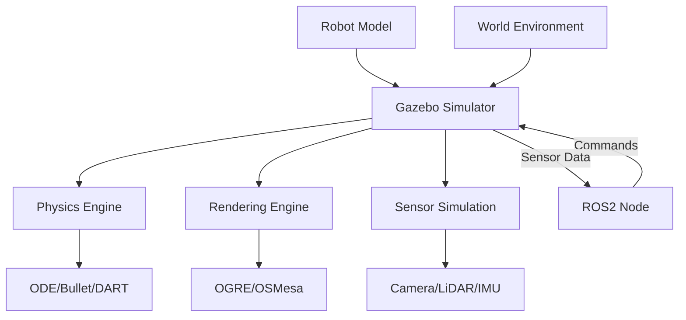

# Chapter 1: Gazebo Fundamentals

## Learning Outcomes

After completing this chapter, you will be able to:
- Set up and configure Gazebo simulation environments
- Create robot models using SDF (Simulation Description Format)
- Implement physics-based simulations with accurate dynamics
- Use Gazebo plugins for sensor integration and control

## 1. Introduction to Gazebo

Gazebo is a physics-based 3D simulation environment that provides:
- Accurate physics simulation using ODE, Bullet, or DART engines
- High-quality graphics rendering
- Flexible robot modeling using SDF
- Integration with ROS/ROS2 for robotics development

### Key Features
- Dynamic simulation with multiple physics engines
- Sensor simulation (cameras, LiDAR, IMU, etc.)
- Multiple rendering options
- Plugin system for custom functionality
- Integration with ROS/ROS2

## 2. Gazebo World Structure

A Gazebo simulation consists of:
- **World file** (.world): Defines the environment, lighting, and physics properties
- **Model files** (.sdf): Define robot and object models
- **Plugins**: Extend functionality for sensors, controllers, and interfaces

Example world file structure:

```xml
<?xml version="1.0" ?>
<sdf version="1.7">
  <world name="default">
    <include>
      <uri>model://ground_plane</uri>
    </include>
    <include>
      <uri>model://sun</uri>
    </include>

    <!-- Your robot model -->
    <include>
      <uri>model://my_robot</uri>
    </include>

    <physics type="ode">
      <max_step_size>0.001</max_step_size>
      <real_time_factor>1</real_time_factor>
    </physics>
  </world>
</sdf>
```

## 3. Robot Modeling with SDF

SDF (Simulation Description Format) is an XML-based format for describing robots and environments:

```xml
<?xml version="1.0" ?>
<sdf version="1.7">
  <model name="my_robot">
    <link name="chassis">
      <pose>0 0 0.1 0 0 0</pose>
      <collision name="collision">
        <geometry>
          <box>
            <size>1.0 0.5 0.2</size>
          </box>
        </geometry>
      </collision>
      <visual name="visual">
        <geometry>
          <box>
            <size>1.0 0.5 0.2</size>
          </box>
        </geometry>
      </visual>
      <inertial>
        <mass>1.0</mass>
        <inertia>
          <ixx>0.01</ixx>
          <iyy>0.01</iyy>
          <izz>0.01</izz>
        </inertia>
      </inertial>
    </link>
  </model>
</sdf>
```

## 4. Gazebo Plugins

Gazebo uses plugins to extend functionality. Common plugin types:
- **Sensor plugins**: Camera, LiDAR, IMU, etc.
- **Controller plugins**: Motor controllers, joint controllers
- **World plugins**: Custom world behavior
- **GUI plugins**: Custom user interface elements

Example sensor plugin:

```xml
<sensor name="camera" type="camera">
  <camera name="my_camera">
    <horizontal_fov>1.047</horizontal_fov>
    <image>
      <width>640</width>
      <height>480</height>
      <format>R8G8B8</format>
    </image>
    <clip>
      <near>0.1</near>
      <far>100</far>
    </clip>
  </camera>
  <plugin name="camera_controller" filename="libgazebo_ros_camera.so">
    <frame_name>camera_frame</frame_name>
  </plugin>
</sensor>
```

## Safety Considerations

When working with Gazebo simulations:
- Always validate simulation results with real-world testing
- Understand the limitations of physics approximations
- Consider computational complexity for real-time applications
- Plan for differences between simulation and reality (sim-to-real gap)

## Exercises

1. Create a simple robot model with differential drive and a camera sensor in Gazebo.
2. Implement a world file with obstacles and run navigation simulations.
3. Add a LiDAR sensor to your robot and implement obstacle detection.

## Diagram

