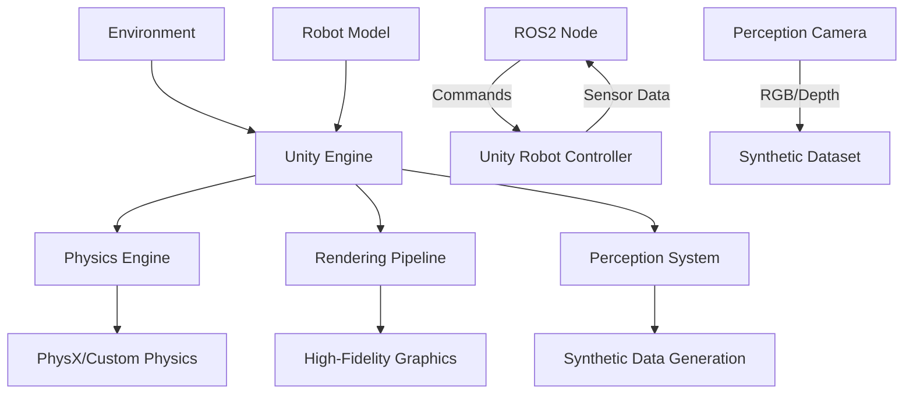

# Chapter 2: Unity Robotics

## Learning Outcomes

After completing this chapter, you will be able to:
- Set up Unity for robotics simulation using Unity Robotics packages
- Create realistic environments with physics and lighting
- Implement robot control systems within Unity
- Use Unity's perception tools for synthetic data generation

## 1. Introduction to Unity for Robotics

Unity provides a powerful game engine approach to robotics simulation with:
- High-fidelity graphics and rendering
- Advanced physics simulation
- Flexible scripting with C#
- Asset store with pre-built environments and models
- Cross-platform deployment capabilities

### Unity Robotics Hub
The Unity Robotics Hub provides:
- ROS# for ROS/ROS2 communication
- Perception package for synthetic data generation
- ML-Agents for reinforcement learning
- Visual Design tools for environment creation

## 2. Unity Robotics Setup

### Required Packages
- Unity Robotics Package (com.unity.robotics)
- ROS# communication package
- Perception package
- ML-Agents (optional)

### Basic Unity Robot Controller

```csharp
using UnityEngine;
using Unity.Robotics.ROSTCPConnector;
using RosMessageTypes.Geometry;

public class UnityRobotController : MonoBehaviour
{
    private ROSConnection ros;
    private float linearVelocity = 0f;
    private float angularVelocity = 0f;

    void Start()
    {
        ros = ROSConnection.GetOrCreateInstance();
        ros.RegisterPublisher<TwistMsg>("/cmd_vel");
    }

    void Update()
    {
        // Publish velocity commands
        var twist = new TwistMsg();
        twist.linear = new Vector3Msg(linearVelocity, 0, 0);
        twist.angular = new Vector3Msg(0, 0, angularVelocity);

        ros.Publish("/cmd_vel", twist);
    }

    public void SetVelocity(float linear, float angular)
    {
        linearVelocity = linear;
        angularVelocity = angular;
    }
}
```

## 3. Perception in Unity

Unity's perception package enables synthetic data generation:

### Camera Sensors
- RGB cameras with adjustable parameters
- Depth cameras for 3D information
- Semantic segmentation cameras
- Instance segmentation cameras

### Synthetic Data Generation
- Photorealistic rendering
- Automatic annotation generation
- Diverse environmental conditions
- Large-scale dataset creation

Example perception camera setup:

```csharp
using Unity.Robotics.Perception;
using UnityEngine;

public class PerceptionCamera : MonoBehaviour
{
    public PerceptionCamera perceptionCamera;

    void Start()
    {
        perceptionCamera = GetComponent<PerceptionCamera>();
        perceptionCamera.enabled = true;
    }
}
```

## 4. Physics and Environment Design

### Physics Configuration
- Realistic material properties
- Accurate collision detection
- Adjustable gravity and environmental forces
- Flexible joint and constraint systems

### Environment Design Best Practices
- Use realistic lighting conditions
- Implement varied textures and materials
- Include environmental effects (weather, lighting changes)
- Create modular, reusable assets

## Safety Considerations

When using Unity for robotics simulation:
- Understand the differences between game physics and real physics
- Validate simulation results with other simulators or real robots
- Consider computational requirements for complex scenes
- Plan for differences in sensor simulation compared to real hardware

## Exercises

1. Create a Unity scene with a wheeled robot that responds to ROS velocity commands.
2. Implement a perception camera system that generates synthetic training data.
3. Design an environment with multiple rooms and obstacles for navigation testing.

## Diagram

