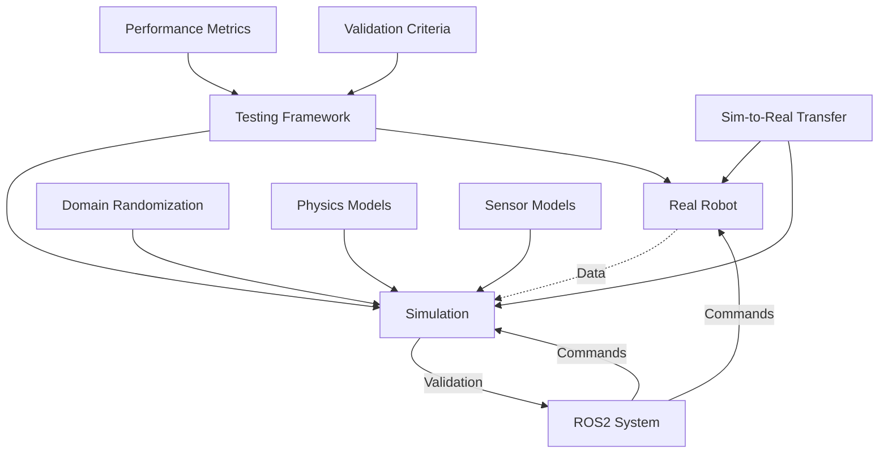

# Chapter 3: Simulation Integration

## Learning Outcomes

After completing this chapter, you will be able to:
- Connect simulation environments to ROS2 systems
- Implement sim-to-real transfer strategies
- Design comprehensive testing workflows using simulation
- Evaluate simulation fidelity and real-world applicability

## 1. ROS2 Integration with Simulators

### Gazebo and ROS2 Integration
Gazebo provides native ROS2 integration through:
- **ros_gz**: New bridge between ROS2 and Gazebo Garden/Harmonic
- **gazebo_ros_pkgs**: Legacy bridge for older Gazebo versions
- **Plugins**: Direct ROS2 communication from simulation

Example Gazebo-ROS2 launch file:

```python
from launch import LaunchDescription
from launch_ros.actions import Node
from launch.actions import IncludeLaunchDescription
from launch.launch_description_sources import PythonLaunchDescriptionSource
from ament_index_python.packages import get_package_share_directory
import os

def generate_launch_description():
    pkg_gazebo_ros = get_package_share_directory('gazebo_ros')

    return LaunchDescription([
        # Launch Gazebo with empty world
        IncludeLaunchDescription(
            PythonLaunchDescriptionSource(
                os.path.join(pkg_gazebo_ros, 'launch', 'gazebo.launch.py')
            )
        ),

        # Spawn robot in Gazebo
        Node(
            package='gazebo_ros',
            executable='spawn_entity.py',
            arguments=['-topic', 'robot_description',
                      '-entity', 'my_robot'],
            output='screen'
        )
    ])
```

### Unity and ROS2 Integration
Unity integration through:
- **ROS#**: C# library for ROS communication
- **Unity Robotics Package**: Enhanced ROS integration
- **TCP/UDP bridges**: Custom communication protocols

## 2. Sim-to-Real Transfer Strategies

### Domain Randomization
- Randomize environmental parameters during training
- Vary lighting, textures, and object positions
- Improve model robustness to real-world variations

### System Identification
- Identify model parameters from real robot data
- Tune simulation parameters to match real behavior
- Validate simulation accuracy with real-world tests

### Progressive Transfer
- Start with simple simulation tasks
- Gradually increase complexity and realism
- Validate at each transfer stage

## 3. Testing and Validation Workflows

### Unit Testing in Simulation
- Test individual robot components
- Validate sensor models and accuracy
- Verify control algorithms

### Integration Testing
- Test complete robot systems
- Validate multi-robot interactions
- Verify communication systems

### Regression Testing
- Automated testing pipelines
- Performance benchmarking
- Continuous validation

## 4. Simulation Fidelity Considerations

### Physics Fidelity
- Mass, inertia, and friction properties
- Contact dynamics and collision responses
- Motor and actuator models

### Sensor Fidelity
- Noise models matching real sensors
- Latency and bandwidth limitations
- Field of view and resolution constraints

### Environmental Fidelity
- Realistic lighting and shadows
- Dynamic environmental conditions
- Accurate geometric models

## Safety Considerations

⚠️ **IMPORTANT SAFETY NOTICE**: When using simulation for robotics development:
- Never assume perfect sim-to-real transfer
- Always validate critical behaviors on real hardware
- Implement safety measures in both simulation and reality
- Consider the limitations of simulated physics and sensors
- Plan for unexpected behaviors in real-world deployment

## Exercises

1. Create a complete simulation-to-ROS2 pipeline with a mobile robot performing navigation tasks.
2. Implement a domain randomization system to improve sim-to-real transfer.
3. Design a testing framework that validates robot behaviors across simulation and reality.

## Diagram

