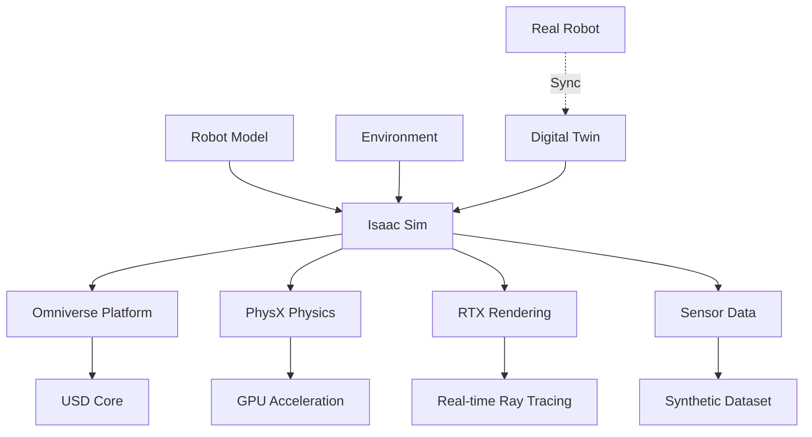

# Chapter 1: Isaac Sim

## Learning Outcomes

After completing this chapter, you will be able to:
- Set up and configure Isaac Sim for robotics simulation
- Create high-fidelity robot and environment models
- Implement photorealistic rendering and synthetic data generation
- Use Isaac Sim for digital twin applications

## 1. Introduction to Isaac Sim

Isaac Sim is NVIDIA's reference application for robotics simulation based on the Omniverse platform. It provides:
- Physically accurate simulation with PhysX engine
- Photorealistic rendering using RTX technology
- Integrated development environment for robotics
- GPU-accelerated simulation for complex scenarios

### Key Features
- High-fidelity physics simulation
- Real-time ray tracing and global illumination
- Synthetic data generation for AI training
- Integration with Isaac ROS and other frameworks
- Extensible through Python and USD (Universal Scene Description)

## 2. Omniverse and USD Foundation

Isaac Sim is built on NVIDIA Omniverse and uses USD (Universal Scene Description) as its core data format:

### USD Concepts
- **Prims**: Basic scene objects (primitives)
- **Properties**: Attributes of prims (position, color, etc.)
- **Relationships**: Connections between prims
- **Payloads**: Large data references
- **Variants**: Different versions of the same asset

Example USD stage creation:

```python
import omni
from pxr import Usd, UsdGeom, Gf

# Create a new USD stage
stage = omni.usd.get_context().get_stage()

# Create a Xform prim (transformable object)
xform = UsdGeom.Xform.Define(stage, "/World/Robot")

# Add a mesh
mesh = UsdGeom.Mesh.Define(stage, "/World/Robot/Chassis")
mesh.CreatePointsAttr([(0, 0, 0), (1, 0, 0), (0, 1, 0)])
```

## 3. Robot and Environment Creation

### Robot Models
Isaac Sim uses the Robot Definition Format (RDF) based on USD:
- Joint definitions with limits and dynamics
- Link properties with mass and inertia
- Sensor placements and parameters
- Material properties and visual appearance

### Environment Design
- Procedural environment generation
- High-resolution textures and materials
- Dynamic lighting and weather conditions
- Interactive objects and scenarios

## 4. Synthetic Data Generation

Isaac Sim provides comprehensive synthetic data generation:

### Sensor Simulation
- RGB cameras with various parameters
- Depth sensors with noise models
- LiDAR with realistic beam patterns
- IMU and other inertial sensors

### Annotation Tools
- Semantic segmentation
- Instance segmentation
- 2D/3D bounding boxes
- Keypoint annotations
- Depth and normal maps

Example synthetic data pipeline:

```python
import omni.replicator.core as rep

# Define a camera
camera = rep.create.camera()

# Generate semantic segmentation
with rep.trigger.on_frame(num_frames=100):
    # Randomize lighting
    lights = rep.get.light()
    with lights.randomize(range=(1000, 5000)):
        lights.color = rep.randomizer.color_temperature(range=(3000, 8000))

    # Generate segmentation
    with camera:
        rep.modify.pose(
            position=rep.distribution.uniform((-5, -5, 1), (5, 5, 3)),
            rotation=rep.distribution.uniform((-10, -10, -180), (10, 10, 180))
        )

    # Output configurations
    rep.WriterRegistry.get("BasicWriter").write(
        output_dir="output_data",
        rgb=True,
        semantic_segmentation=True,
        bounding_box_2d_tight=True
    )
```

## 5. Digital Twin Applications

Isaac Sim enables digital twin capabilities:
- Real-time synchronization with physical systems
- Predictive maintenance and monitoring
- Process optimization and validation
- Training and testing in virtual environments

## Safety Considerations

When using Isaac Sim:
- Validate simulation results with real-world data
- Understand the computational requirements for real-time simulation
- Plan for differences between simulated and real sensor data
- Consider the limitations of physics approximations in complex scenarios

## Exercises

1. Create a simple robot model in Isaac Sim with basic sensors (camera and LiDAR).
2. Implement a photorealistic warehouse environment with dynamic lighting.
3. Generate a synthetic dataset with semantic segmentation for training a perception model.

## Diagram

