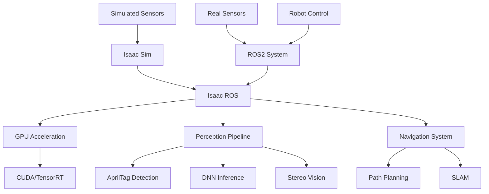

# Chapter 2: Isaac ROS

## Learning Outcomes

After completing this chapter, you will be able to:
- Integrate Isaac Sim with ROS2 using Isaac ROS packages
- Implement GPU-accelerated perception pipelines
- Use Isaac ROS for navigation and manipulation tasks
- Leverage hardware acceleration for robotics applications

## 1. Introduction to Isaac ROS

Isaac ROS is a collection of hardware-accelerated perception and navigation packages that bridge the gap between simulation and reality. Key components include:

### Perception Packages
- **Isaac ROS Apriltag**: GPU-accelerated AprilTag detection
- **Isaac ROS DNN Inference**: Deep learning inference with TensorRT
- **Isaac ROS Stereo DNN**: Stereo vision with deep learning
- **Isaac ROS ISAAC ROS Visual SLAM**: Visual SLAM with GPU acceleration

### Navigation and Manipulation
- **Isaac ROS Navigation**: GPU-accelerated path planning
- **Isaac ROS Manipulation**: GPU-accelerated manipulation planning
- **Isaac ROS Multi-Vector Map**: High-definition mapping

## 2. Isaac ROS Package Architecture

Isaac ROS packages follow the ROS2 component architecture with GPU acceleration:

### Hardware Acceleration
- CUDA for parallel computation
- TensorRT for optimized inference
- RTX GPUs for ray tracing and rendering
- Hardware-specific optimizations

### Component Structure
- **Node Components**: Reusable hardware-accelerated functions
- **Message Interfaces**: Standard ROS2 message types
- **Parameter Systems**: Configurable acceleration settings
- **Diagnostic Tools**: Performance monitoring and optimization

Example Isaac ROS node:

```python
import rclpy
from rclpy.node import Node
from sensor_msgs.msg import Image
from isaac_ros_apriltag_interfaces.msg import AprilTagDetectionArray

class IsaacROSExample(Node):
    def __init__(self):
        super().__init__('isaac_ros_example')

        # Create subscriber for camera images
        self.subscription = self.create_subscription(
            Image,
            '/camera/image_rect_color',
            self.image_callback,
            10
        )

        # Create publisher for AprilTag detections
        self.publisher = self.create_publisher(
            AprilTagDetectionArray,
            '/apriltag_detections',
            10
        )

        self.get_logger().info('Isaac ROS Example Node Started')

    def image_callback(self, msg):
        # Process image using Isaac ROS GPU acceleration
        # Detection happens in hardware
        pass
```

## 3. GPU-Accelerated Perception

### DNN Inference Pipeline
Isaac ROS provides optimized deep learning inference:

```python
import rclpy
from rclpy.node import Node
from sensor_msgs.msg import Image
from vision_msgs.msg import Detection2DArray

class IsaacDNNInference(Node):
    def __init__(self):
        super().__init__('isaac_dnn_inference')

        # Isaac ROS DNN Inference node
        # Uses TensorRT for optimized GPU inference
        self.subscription = self.create_subscription(
            Image,
            'image_input',
            self.inference_callback,
            10
        )

        self.publisher = self.create_publisher(
            Detection2DArray,
            'detections',
            10
        )

    def inference_callback(self, msg):
        # GPU-accelerated inference happens automatically
        # with Isaac ROS optimized nodes
        pass
```

### Stereo Vision and Depth Estimation
- GPU-accelerated stereo matching
- Real-time depth map generation
- Optimized CUDA kernels
- Sub-pixel accuracy

## 4. Isaac ROS Navigation

### GPU-Accelerated Path Planning
- Accelerated costmap generation
- Optimized A* and Dijkstra algorithms
- Real-time dynamic replanning
- Multi-layer costmap fusion

### SLAM with GPU Acceleration
- Visual SLAM with GPU feature extraction
- Loop closure detection acceleration
- Map optimization with CUDA
- Real-time mapping performance

## 5. Integration with Isaac Sim

Isaac ROS packages work seamlessly with Isaac Sim:
- Sensor data format compatibility
- Realistic sensor simulation
- Hardware-in-the-loop testing
- Sim-to-real transfer validation

Example launch file for Isaac ROS + Sim integration:

```python
from launch import LaunchDescription
from launch_ros.actions import ComposableNodeContainer
from launch_ros.descriptions import ComposableNode

def generate_launch_description():
    # Isaac ROS container with multiple components
    container = ComposableNodeContainer(
        name='isaac_ros_container',
        namespace='',
        package='rclcpp_components',
        executable='component_container_mt',
        composable_node_descriptions=[
            ComposableNode(
                package='isaac_ros_apriltag',
                plugin='nvidia::isaac_ros::apriltag::AprilTagNode',
                name='apriltag',
                parameters=[{
                    'size': 0.3,
                    'max_tags': 64,
                    'tile_size': 1,
                }],
            ),
        ],
        output='screen',
    )

    return LaunchDescription([container])
```

## Safety Considerations

⚠️ **IMPORTANT SAFETY NOTICE**: When using Isaac ROS:
- Verify that GPU acceleration is properly configured and monitored
- Test perception systems thoroughly in simulation before real-world deployment
- Implement proper error handling for hardware acceleration failures
- Monitor GPU utilization and thermal conditions
- Plan for fallback systems in case of hardware acceleration failures

## Exercises

1. Implement a GPU-accelerated object detection pipeline using Isaac ROS DNN Inference.
2. Create a navigation system that uses Isaac ROS for path planning and obstacle avoidance.
3. Design a manipulation system that leverages Isaac ROS for 3D perception and planning.

## Diagram

