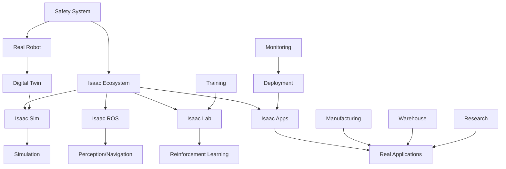

# Chapter 3: Isaac Applications

## Learning Outcomes

After completing this chapter, you will be able to:
- Deploy Isaac-based solutions for real-world robotics applications
- Implement reinforcement learning with Isaac Lab
- Design end-to-end robotics systems using Isaac ecosystem
- Evaluate and optimize Isaac-based systems for performance

## 1. Isaac Lab for Reinforcement Learning

Isaac Lab is NVIDIA's reinforcement learning framework built on top of Isaac Sim:

### Key Components
- **Environments**: Physics-based simulation environments
- **Actors**: Robots and objects to control
- **Observations**: Sensor and state data
- **Rewards**: Learning objectives and penalties
- **Actions**: Control commands to the robot

### RL Algorithms
- PPO (Proximal Policy Optimization)
- SAC (Soft Actor-Critic)
- DDPG (Deep Deterministic Policy Gradient)
- Custom algorithm implementations

Example Isaac Lab environment:

```python
import omni.isaac.orbit.sim as sim_utils
from omni.isaac.orbit.assets import ArticulationCfg
from omni.isaac.orbit.envs import RLTaskEnv, RLTaskEnvCfg
from omni.isaac.orbit.sensors import ContactSensorCfg

class IsaacLabExampleEnv(RLTaskEnv):
    def __init__(self, cfg: RLTaskEnvCfg):
        super().__init__(cfg)

        # Define robot asset
        self.robot = Articulation(cfg=self.cfg.robot_cfg)

        # Define sensors
        self.contact_sensor = sim_utils.define_prim("/World/Robot/ContactSensor")

    def _get_observations(self) -> dict:
        """Get observations from the environment"""
        return {
            "joint_pos": self.robot.data.joint_pos,
            "joint_vel": self.robot.data.joint_vel,
            "ee_pos": self.robot.data.ee_pos,
        }

    def _get_rewards(self) -> dict:
        """Calculate rewards for the current step"""
        return {
            "reach_target": self._compute_reach_reward(),
            "action_smoothness": self._compute_action_smoothness_reward(),
        }
```

## 2. Isaac for Manufacturing and Logistics

### Warehouse Automation
- Autonomous mobile robots (AMRs)
- Goods-to-person systems
- Automated storage and retrieval
- Fleet management and coordination

### Assembly and Manufacturing
- Precision manipulation tasks
- Quality inspection systems
- Collaborative robots (cobots)
- Adaptive manufacturing systems

## 3. Isaac for Research and Development

### Academic Research
- Benchmark datasets and environments
- Algorithm development and testing
- Multi-robot systems research
- Human-robot interaction studies

### Industrial R&D
- Digital twin development
- Process optimization
- Safety system validation
- New robot design evaluation

## 4. Performance Optimization

### GPU Resource Management
- Memory allocation and optimization
- CUDA context management
- Multi-GPU scaling strategies
- Compute vs graphics workload balancing

### Simulation Performance
- Level of detail (LOD) management
- Physics approximation strategies
- Sensor update rate optimization
- Scene complexity management

### Real-time Constraints
- Deterministic execution
- Latency optimization
- Synchronization mechanisms
- Real-time scheduling

## 5. Deployment Strategies

### Edge Deployment
- Jetson platform optimization
- Containerized deployment
- Resource-constrained operation
- Power consumption management

### Cloud Deployment
- Scalable simulation environments
- Distributed training
- Remote monitoring and control
- Fleet management systems

## Safety Considerations

⚠️ **IMPORTANT SAFETY NOTICE**: When deploying Isaac-based systems:
- Implement comprehensive safety checks and emergency stops
- Validate all learned behaviors in simulation before real-world testing
- Monitor system behavior continuously during operation
- Plan for graceful degradation in case of system failures
- Follow all applicable safety standards for your application domain

## Exercises

1. Create a reinforcement learning environment in Isaac Lab for a manipulation task.
2. Design a warehouse automation system using Isaac for simulation and control.
3. Implement a digital twin system that synchronizes with a real robot using Isaac.

## Diagram

