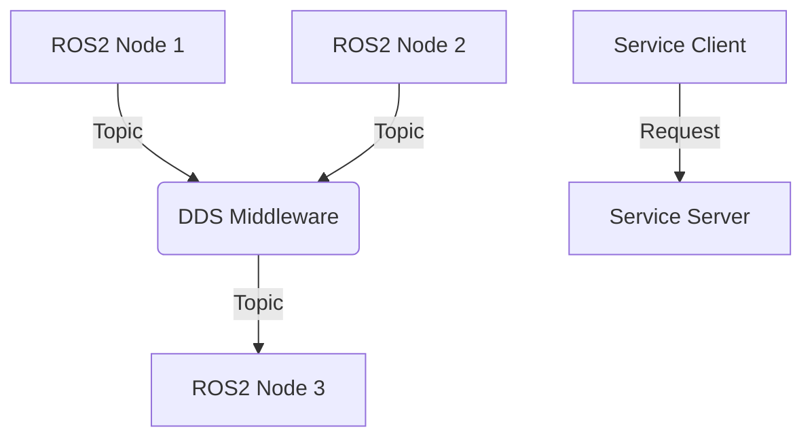

# Chapter 1: ROS2 Fundamentals

## Learning Outcomes

After completing this chapter, you will be able to:
- Explain the core concepts of ROS2 architecture
- Create and run basic ROS2 nodes
- Implement topic-based communication between nodes
- Use services for request-response communication

## 1. Introduction to ROS2

ROS2 (Robot Operating System 2) is a flexible framework for writing robot software. It is a collection of tools, libraries, and conventions that aim to simplify the task of creating complex and robust robot behavior across a wide variety of robot platforms.

### Key Concepts

- **Nodes**: Processes that perform computation
- **Topics**: Named buses over which nodes exchange messages
- **Messages**: ROS data types used when publishing or subscribing to a Topic
- **Services**: Synchronous request/response communication
- **Actions**: Asynchronous goal-oriented communication

## 2. ROS2 Architecture

ROS2 uses a DDS (Data Distribution Service) implementation for communication between nodes. This provides a more robust and scalable architecture compared to ROS1.

### DDS Implementations
- Fast DDS (default)
- Cyclone DDS
- RTI Connext DDS

## 3. Creating Your First ROS2 Node

Here's a simple ROS2 node example:

```python
import rclpy
from rclpy.node import Node

class MinimalPublisher(Node):
    def __init__(self):
        super().__init__('minimal_publisher')
        self.publisher_ = self.create_publisher(String, 'topic', 10)
        timer_period = 0.5  # seconds
        self.timer = self.create_timer(timer_period, self.timer_callback)
        self.i = 0

    def timer_callback(self):
        msg = String()
        msg.data = 'Hello World: %d' % self.i
        self.publisher_.publish(msg)
        self.get_logger().info('Publishing: "%s"' % msg.data)
        self.i += 1

def main(args=None):
    rclpy.init(args=args)
    minimal_publisher = MinimalPublisher()
    rclpy.spin(minimal_publisher)
    minimal_publisher.destroy_node()
    rclpy.shutdown()

if __name__ == '__main__':
    main()
```

## 4. Safety Considerations

When developing with ROS2, always consider:
- Proper error handling in node execution
- Resource management and cleanup
- Safe communication patterns
- Hardware safety when interfacing with real robots

## Exercises

1. Create a ROS2 package named "robot_basics" with a publisher node that publishes "Hello Robot" messages every 2 seconds.
2. Implement a subscriber node that listens to the publisher and logs the received messages.
3. Create a service server that returns the current system time when called.

## Diagram

