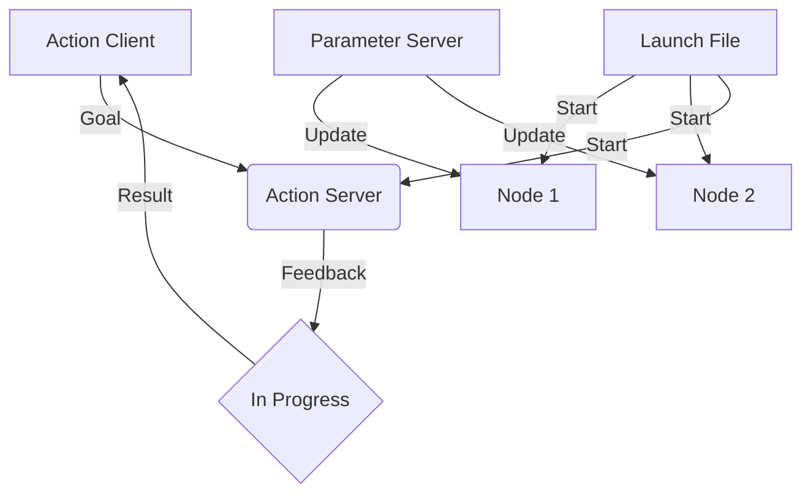

# Chapter 2: Advanced ROS2

## Learning Outcomes

After completing this chapter, you will be able to:
- Implement ROS2 actions for complex tasks with feedback
- Manage parameters across nodes
- Use launch files to start complex systems
- Design robust communication patterns

## 1. ROS2 Actions

Actions are a ROS concept that provides a way to implement tasks that take a long time to complete and may be preempted. They are built on top of service calls and topics.

### Action Structure
- Goal: Request to start a task
- Result: Final outcome of the task
- Feedback: Status updates during task execution

Example action server implementation:

```python
import rclpy
from rclpy.action import ActionServer
from rclpy.node import Node

from example_interfaces.action import Fibonacci


class FibonacciActionServer(Node):

    def __init__(self):
        super().__init__('fibonacci_action_server')
        self._action_server = ActionServer(
            self,
            Fibonacci,
            'fibonacci',
            self.execute_callback)

    def execute_callback(self, goal_handle):
        self.get_logger().info('Executing goal...')

        feedback_msg = Fibonacci.Feedback()
        feedback_msg.sequence = [0, 1]

        for i in range(1, goal_handle.request.order):
            if goal_handle.is_cancel_requested:
                goal_handle.canceled()
                self.get_logger().info('Goal canceled')
                return Fibonacci.Result()

            feedback_msg.sequence.append(
                feedback_msg.sequence[i] + feedback_msg.sequence[i-1])

            goal_handle.publish_feedback(feedback_msg)

        goal_handle.succeed()
        result = Fibonacci.Result()
        result.sequence = feedback_msg.sequence
        return result
```

## 2. Parameter Management

ROS2 provides a robust parameter system that allows nodes to be configured at runtime.

### Parameter Features
- Dynamic parameter updates
- Parameter validation
- Parameter declarations with types and descriptions
- Parameter services for external management

## 3. Launch Systems

Launch files allow you to start multiple nodes with a single command and manage their lifecycle.

Example launch file:

```python
from launch import LaunchDescription
from launch_ros.actions import Node

def generate_launch_description():
    return LaunchDescription([
        Node(
            package='turtlesim',
            executable='turtlesim_node',
            name='sim'
        ),
        Node(
            package='turtlesim',
            executable='turtle_teleop_key',
            name='teleop'
        )
    ])
```

## 4. Quality of Service (QoS) Settings

QoS settings allow you to control the behavior of communication between nodes:
- Reliability: Best effort vs reliable
- Durability: Volatile vs transient local
- History: Keep last vs keep all

## Exercises

1. Create an action server that simulates a robot navigation task, providing feedback on progress and final result.
2. Implement a parameter server that allows external configuration of robot behavior.
3. Design a launch file that starts a complete robot system with multiple nodes and proper configurations.

## Diagram

