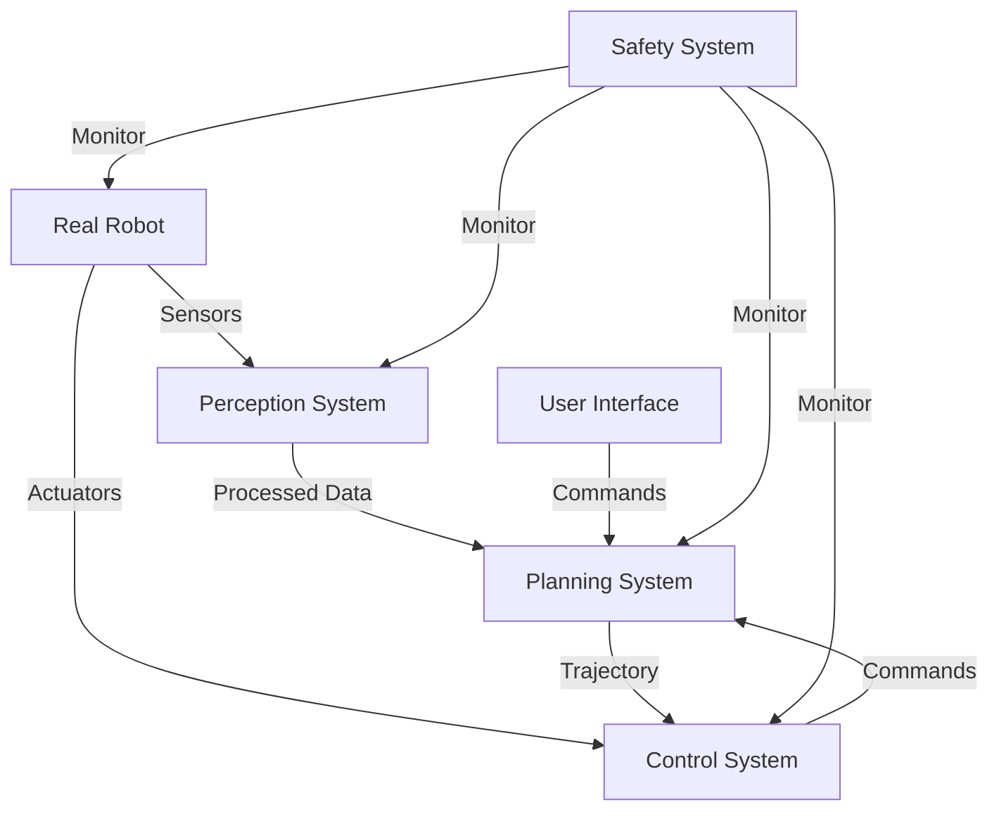

# Chapter 3: ROS2 Applications

## Learning Outcomes

After completing this chapter, you will be able to:
- Integrate ROS2 with real hardware systems
- Design complex robotic applications using multiple nodes
- Implement perception and control systems
- Apply best practices for production ROS2 deployments

## 1. Hardware Integration

ROS2 provides several approaches for integrating with real hardware:

### Device Drivers
- Direct integration with sensors and actuators
- Use of ros2_control framework for standardized hardware interfaces
- Real-time considerations and determinism

### ros2_control Framework
The ros2_control framework provides a standardized way to interface with hardware components:
- Hardware interfaces
- Controller manager
- Standardized message types

Example hardware interface:

```python
import rclpy
from rclpy.node import Node
from sensor_msgs.msg import JointState
from trajectory_msgs.msg import JointTrajectory, JointTrajectoryPoint

class HardwareInterface(Node):
    def __init__(self):
        super().__init__('hardware_interface')
        self.joint_state_pub = self.create_publisher(JointState, 'joint_states', 10)
        self.subscription = self.create_subscription(
            JointTrajectory,
            'joint_trajectory',
            self.trajectory_callback,
            10)

    def trajectory_callback(self, msg):
        # Process trajectory commands
        for point in msg.points:
            # Send commands to hardware
            pass
```

## 2. Perception Systems

ROS2 provides extensive support for perception systems:

### Sensor Processing
- Camera drivers and image processing
- LiDAR processing and point cloud manipulation
- Sensor fusion techniques

### Computer Vision Integration
- OpenCV integration with ROS2
- Deep learning model deployment
- Real-time processing considerations

## 3. Control Systems

### Motion Planning
- Integration with MoveIt2 for motion planning
- Trajectory generation and execution
- Collision detection and avoidance

### Control Architecture
- Hierarchical control systems
- Feedback control loops
- Safety interlocks and emergency stops

## 4. Deployment Considerations

### Containerization
- Docker containers for ROS2 applications
- ROS2 with Kubernetes for large-scale deployments
- Resource management and optimization

### Security
- ROS2 security features
- Network security and authentication
- Data protection and privacy

## Safety Warnings

⚠️ **IMPORTANT SAFETY NOTICE**: When implementing ROS2 applications with real hardware:
- Always implement proper safety interlocks and emergency stops
- Test thoroughly in simulation before connecting to real hardware
- Implement proper error handling and fault recovery
- Use appropriate safety-rated hardware for critical functions
- Follow all applicable safety standards for your robot type

## Exercises

1. Create a complete robot control system that integrates with a simulated or real robot, including perception, planning, and control components.
2. Implement a safety system that monitors robot state and implements emergency stop functionality.
3. Design a deployment strategy for your robot system using containerization.

## Diagram

