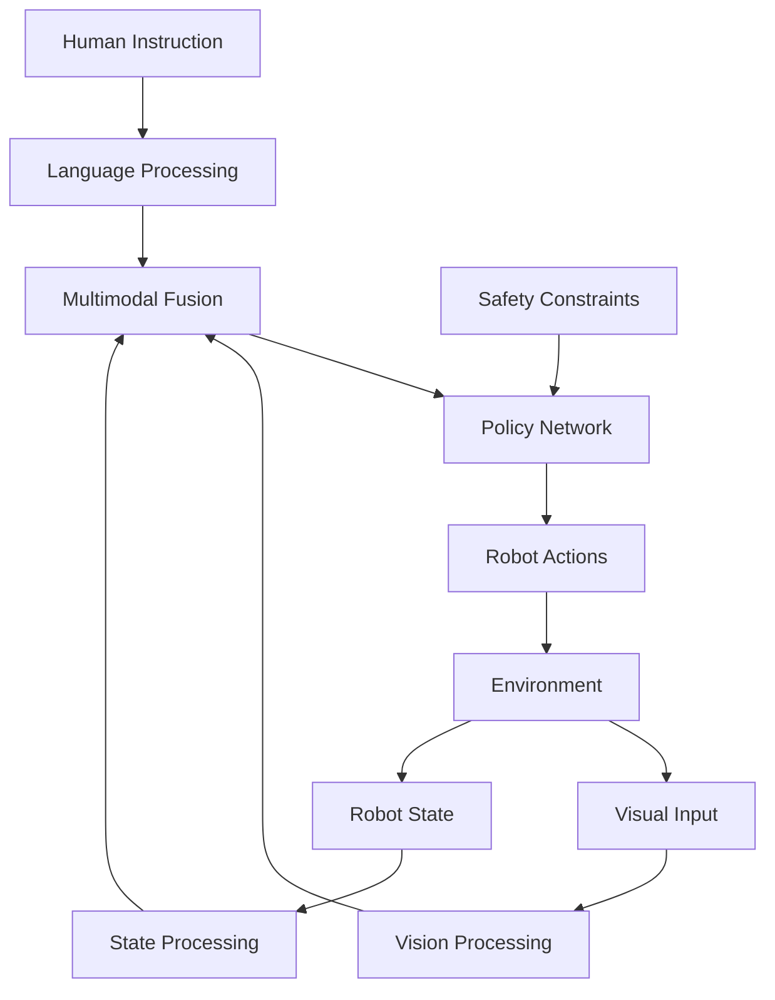

# Chapter 1: VLA Fundamentals

## Learning Outcomes

After completing this chapter, you will be able to:
- Explain the principles of Vision-Language-Action models
- Understand how vision, language, and action components integrate
- Identify appropriate use cases for VLA systems
- Design multimodal input processing pipelines

## 1. Introduction to Vision-Language-Action Models

Vision-Language-Action (VLA) models represent a new paradigm in robotics that combines:
- **Vision**: Understanding the visual environment
- **Language**: Processing natural language instructions
- **Action**: Generating appropriate robotic behaviors

### Key Characteristics
- Multimodal learning from vision, language, and action data
- End-to-end training on robotic manipulation tasks
- Natural language interface for robot control
- Generalization across tasks and environments

### Benefits of VLA Systems
- Intuitive human-robot interaction through language
- Generalization to novel tasks and environments
- Reduced need for task-specific programming
- Improved adaptability to changing conditions

## 2. VLA Architecture Components

### Vision Processing
- Visual feature extraction using CNNs or Vision Transformers
- Object detection and segmentation
- 3D scene understanding
- Visual grounding to identify relevant objects

### Language Understanding
- Natural language processing using transformer models
- Instruction parsing and semantic understanding
- Intent recognition and goal formulation
- Context awareness and memory

### Action Generation
- Policy networks that map observations to actions
- Imitation learning from human demonstrations
- Reinforcement learning for task optimization
- Motor control and trajectory planning

### Multimodal Fusion
- Cross-modal attention mechanisms
- Joint embedding spaces
- Temporal consistency
- Sensorimotor integration

Example VLA architecture:

```python
import torch
import torch.nn as nn

class VLAModel(nn.Module):
    def __init__(self, vision_encoder, language_encoder, policy_network):
        super().__init__()
        self.vision_encoder = vision_encoder
        self.language_encoder = language_encoder
        self.policy_network = policy_network
        self.fusion_layer = nn.Linear(2048, 1024)  # Example fusion layer

    def forward(self, image, language_instruction, proprioceptive_state):
        # Encode visual input
        visual_features = self.vision_encoder(image)

        # Encode language instruction
        language_features = self.language_encoder(language_instruction)

        # Fuse multimodal information
        fused_features = torch.cat([visual_features, language_features], dim=-1)
        fused_features = self.fusion_layer(fused_features)

        # Generate action
        action = self.policy_network(fused_features, proprioceptive_state)

        return action
```

## 3. Training VLA Models

### Data Requirements
- Robot demonstration datasets
- Vision-language pairs with corresponding actions
- Multi-task and multi-environment data
- Human-annotated instruction datasets

### Training Approaches
- Behavioral cloning from demonstrations
- Reinforcement learning with language rewards
- Imitation learning with visual feedback
- Pre-training on large vision-language datasets

### Foundation Models
- Pre-trained vision-language models (CLIP, BLIP, etc.)
- Large language models for instruction understanding
- Transfer learning to robotic tasks
- Few-shot adaptation capabilities

## 4. Applications and Use Cases

### Household Robotics
- Kitchen assistance and food preparation
- Cleaning and organization tasks
- Object manipulation and retrieval
- Personal care assistance

### Industrial Applications
- Assembly and manufacturing tasks
- Quality inspection and testing
- Material handling and logistics
- Maintenance and repair tasks

### Service Robotics
- Customer service and assistance
- Healthcare and therapy support
- Educational and entertainment applications
- Retail and hospitality services

## Safety Considerations

⚠️ **IMPORTANT SAFETY NOTICE**: When implementing VLA systems:
- Always include safety constraints and physical limits
- Implement robust error handling and fallback behaviors
- Validate language understanding in safety-critical scenarios
- Plan for misinterpretation of instructions
- Include human oversight and intervention capabilities

## Exercises

1. Design a VLA system architecture for a kitchen assistant robot that can follow natural language commands.
2. Implement a simple multimodal fusion mechanism that combines visual and language inputs.
3. Create a dataset structure for training a VLA model on a basic manipulation task.

## Diagram

