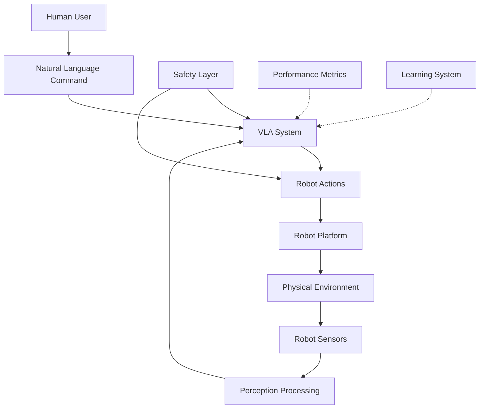

# Chapter 2: VLA Systems

## Learning Outcomes

After completing this chapter, you will be able to:
- Implement complete VLA systems for robotic manipulation
- Design human-robot interaction using natural language
- Integrate VLA models with robotic platforms
- Evaluate and optimize VLA system performance

## 1. Implementing VLA Systems

### System Architecture
A complete VLA system includes:
- **Perception pipeline**: Real-time visual processing
- **Language interface**: Natural language understanding
- **Policy network**: Action generation from multimodal inputs
- **Robot interface**: Low-level control and execution
- **Safety layer**: Constraints and emergency procedures

### Real-time Processing Pipeline

```python
import rospy
import torch
from sensor_msgs.msg import Image
from std_msgs.msg import String
from geometry_msgs.msg import Twist

class VLASystem:
    def __init__(self):
        # Initialize VLA model
        self.model = self.load_vla_model()

        # ROS interfaces
        self.image_sub = rospy.Subscriber('/camera/rgb/image_raw', Image, self.image_callback)
        self.command_sub = rospy.Subscriber('/command', String, self.command_callback)
        self.action_pub = rospy.Publisher('/robot/cmd_vel', Twist, queue_size=10)

        # Internal state
        self.current_image = None
        self.current_command = None
        self.robot_state = None

    def image_callback(self, msg):
        # Process camera image
        self.current_image = self.process_image(msg)

    def command_callback(self, msg):
        # Process natural language command
        self.current_command = self.process_language(msg.data)

    def execute_step(self):
        if self.current_image is not None and self.current_command is not None:
            # Generate action using VLA model
            action = self.model(
                image=self.current_image,
                language_instruction=self.current_command,
                proprioceptive_state=self.robot_state
            )

            # Execute action
            self.publish_action(action)

    def load_vla_model(self):
        # Load pre-trained VLA model
        # This would typically load a model like RT-1, BC-Z, or similar
        pass

    def process_image(self, image_msg):
        # Convert ROS image to model input
        pass

    def process_language(self, command_str):
        # Convert natural language to model input
        pass

    def publish_action(self, action):
        # Convert model output to robot command
        cmd_vel = Twist()
        cmd_vel.linear.x = action[0]
        cmd_vel.angular.z = action[1]
        self.action_pub.publish(cmd_vel)
```

## 2. Human-Robot Interaction Design

### Natural Language Interface
- Command parsing and semantic understanding
- Context awareness and memory
- Clarification requests when ambiguous
- Feedback and confirmation mechanisms

### Interaction Patterns
- **Direct commands**: "Pick up the red cup"
- **Goal-oriented**: "Bring me something to drink"
- **Collaborative**: "Help me set the table"
- **Learning**: "Show me how to do this"

### Error Handling and Recovery
- Recognition of failed actions
- Alternative strategy generation
- Human assistance requests
- Graceful degradation

## 3. Integration with Robotic Platforms

### ROS/ROS2 Integration
- Message type compatibility
- Real-time performance requirements
- Sensor data synchronization
- Multi-robot coordination

### Hardware Considerations
- Compute requirements for VLA models
- Sensor fusion and calibration
- Actuator response characteristics
- Power and thermal management

### Performance Optimization
- Model quantization and compression
- Efficient inference engines (TensorRT, ONNX Runtime)
- Multi-threading and asynchronous processing
- Edge computing deployment

## 4. Evaluation and Benchmarking

### Performance Metrics
- **Success rate**: Task completion percentage
- **Efficiency**: Time to complete tasks
- **Robustness**: Performance under varying conditions
- **Naturalness**: Quality of human-robot interaction

### Benchmark Tasks
- Object manipulation and repositioning
- Multi-step instruction following
- Novel object and task generalization
- Human-robot collaboration scenarios

### Evaluation Protocols
- Standardized test environments
- Diverse object and scene datasets
- Systematic variation of difficulty
- Long-term deployment studies

## 5. Advanced VLA Techniques

### Few-Shot Learning
- Adapting to new tasks with minimal demonstrations
- Meta-learning approaches
- Transfer learning from pre-trained models

### Multi-Modal Feedback
- Visual feedback integration
- Haptic feedback incorporation
- Audio feedback and recognition
- Multisensory fusion

### Long-Horizon Planning
- Task decomposition and sequencing
- Memory and context management
- Subgoal generation and achievement
- Plan adaptation and replanning

## Safety Considerations

⚠️ **IMPORTANT SAFETY NOTICE**: When deploying VLA systems:
- Implement hard safety constraints that override learned behaviors
- Include human-in-the-loop supervision for critical tasks
- Plan for unexpected environmental changes
- Validate system behavior across diverse scenarios
- Include emergency stop mechanisms and fail-safe behaviors

## Exercises

1. Implement a complete VLA system that can follow natural language commands to manipulate objects in a simulated environment.
2. Design a safety layer that constrains VLA-generated actions to safe behaviors.
3. Create an evaluation framework to measure the performance of your VLA system.

## Diagram

